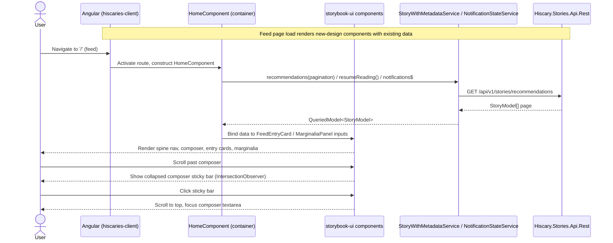
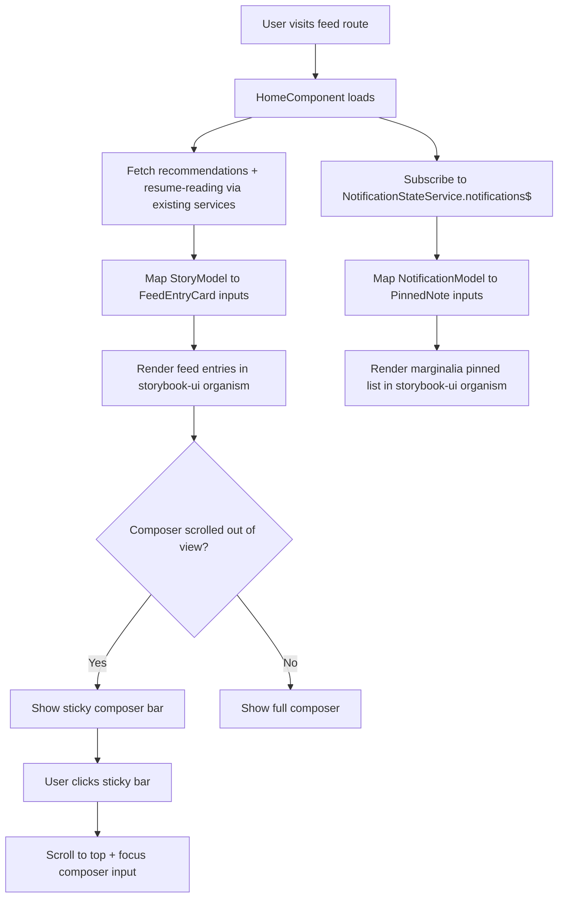

# Spec: Set up Storybook component library and migrate feed page to new UI design (#168)

> **Issue:** #168 · **Repo:** RuslanPr0g/Hiscaries · **Type:** feature · **Date:** 2026-07-10
> **Bounded Context:** Shared (frontend platform/tooling) · **Layers:** Angular frontend, NgRx state

---

## 1. Problem Statement

`client/apps/hiscaries-client` needs to migrate to a new visual design, prototyped as a static mockup at `ideas/UI/hiscaries-feed-ui-scrapbook_v1.html`. Today there is no shared, reusable component library backing this new design — the existing `shared/components/{atoms,molecules,organisms}` tree implements the current design and is not meant to be touched or reused for the new look. Without a dedicated library and real Storybook.js tooling, new-design components would end up built ad hoc, page-local, and undocumented, making a page-by-page design rollout unmanageable. The feed page (currently `HomeComponent` at route `''`, composed of `SearchStoryResumeReadingComponent` and `SearchStoryRecommendationsComponent`) is the first page to migrate, proving the approach end to end.

---

## 2. Requirements

### Functional Requirements

- **FR-01:** WHEN a developer runs the Storybook target for the new library, the system SHALL launch Storybook.js against `client/libs/storybook` with a working `.storybook` configuration.
- **FR-02:** WHEN a developer adds a new atom/molecule/organism component to `client/libs/storybook`, the system SHALL require a co-located `.stories.ts` file so the component is visible and interactively testable in Storybook.
- **FR-03:** WHEN a user navigates to the root route (`''`, currently rendered by `HomeComponent`), the system SHALL render the feed using only components sourced from `client/libs/storybook`, visually matching `ideas/UI/hiscaries-feed-ui-scrapbook_v1.html` (spine nav, composer with collapse-to-sticky-bar behavior, entry cards, marginalia sidebar with pinned notes and trending list).
- **FR-04:** WHEN the composer entry scrolls out of view on the feed page, the system SHALL show a collapsed sticky composer bar; WHEN the user clicks it, the system SHALL scroll to the top and focus the composer's text input, matching the scrapbook's `IntersectionObserver`-driven behavior.
- **FR-05:** WHEN `hiscaries-client` needs a `storybook`-library component, the system SHALL allow it to import that component via a new path alias (e.g. `@storybook-ui/*`) resolving into `client/libs/storybook`.
- **FR-06:** WHEN a presentational component in `client/libs/storybook` is built, the system SHALL keep it pure (inputs/outputs only, `ChangeDetectionStrategy.OnPush`, no direct store/service injection for data), with data-fetching and NgRx wiring staying in `hiscaries-client` container components.

### Non-Functional Requirements

- **NFR-01:** New `storybook`-library components SHALL use semantic HTML and be keyboard-operable (composer textarea, nav items, and composer buttons reachable and actionable via keyboard, with visible focus states).
- **NFR-02:** New `storybook`-library components SHALL render correctly at mobile, tablet, and desktop breakpoints, not only the fixed desktop grid shown in the mockup.
- **NFR-03:** The `storybook` library SHALL be wired into the Nx project graph as a buildable/testable library so `nx affected` and `nx test`/`nx lint` correctly pick up changes to it.

### Out of Scope

- Migrating any page other than the feed page (e.g. library, publish-story, read-story).
- Relocating, refactoring, or deleting the existing `shared/components/{atoms,molecules,organisms}` tree.
- Wiring the composer's "begin writing" action to a real publish-story flow (mockup has no defined backend action for this — treat as a UI stub/navigation placeholder unless the issue owner clarifies).
- Visual/pixel-level design tooling (Figma sync, design tokens pipeline) beyond what's needed to reproduce the scrapbook mockup in code.

---

## 3. Architecture Decision Record (ADR)

### Status
`Proposed`

### Context

The workspace is an Nx Angular monorepo (`client/nx.json`, `@nx/angular` 22.6.5) with a single application project, `hiscaries-client`, and no `client/libs/*` directory yet — all code lives under `apps/hiscaries-client/src/app`. Path aliases are hand-maintained in `client/tsconfig.base.json` (`@shared/*`, `@stories/*`, etc.), each pointing into `apps/hiscaries-client/src/app/*`. There is no Storybook dependency in `client/package.json` today. The existing atomic-design tree (`shared/components/atoms|molecules|organisms`, e.g. `MediaCardComponent`, `SectionHeaderComponent`) backs the current design and is explicitly frozen for this issue. The new design (dark "scrapbook" board aesthetic, `Playfair Display`/`Caveat`/`Inter` fonts, sticky composer bar, entry cards with torn-paper tape/pin decorations) has no code representation yet, only the static HTML mockup.

### Decision

Scaffold a new buildable Nx library at `client/libs/storybook` via `nx g @nx/angular:library storybook --directory=libs/storybook --standalone`, add real Storybook.js to the workspace targeting that library (`nx g @nx/angular:storybook-configuration storybook`), and add a `@storybook-ui/*` path alias in `client/tsconfig.base.json` pointing at `libs/storybook/src/lib/*`. Build the new design's atoms (e.g. spine nav item, avatar badge, chapter badge, pin/tape decorations), molecules (composer, composer sticky bar, entry card, pinned-note, trend row), and organisms (spine nav, feed entry list, marginalia sidebar) from scratch as standalone, `OnPush`, presentational components inside this library, each with a Storybook story. Refactor `HomeComponent` into a smart/dumb split: `HomeComponent` (or a renamed `FeedComponent`) stays the container wired to `SearchStoryRecommendationsComponent`/`SearchStoryResumeReadingComponent`'s underlying data services and `NotificationStateService`, while rendering is delegated entirely to the new `storybook` components.

### Alternatives Considered

| Option | Pros | Cons | Rejected because |
|--------|------|------|-----------------|
| Extend existing `shared/components/*` in place with new "v2" variants | No new Nx library/tooling to set up; reuses existing import paths | Mixes two design systems in one folder; no Storybook isolation; existing components risk accidental edits | Issue explicitly requires a separate library and explicitly leaves `shared/components/*` untouched |
| Use a component library like PrimeNG/Angular Material for the new design's building blocks | Faster initial build, built-in accessibility | Scrapbook design (torn paper, hand-drawn badges, custom fonts) doesn't map onto standard component styling without heavy overrides; issue explicitly wants to avoid heavy reliance on third-party styling libs | Issue guidance keeps PrimeNG only where custom styling isn't a limiting factor — this design is styling-heavy custom UI |

### Consequences

- **Positive:** Establishes an isolated, documented component library and Storybook workflow that subsequent page migrations (tracked as follow-up issues) can build on incrementally without touching legacy components.
- **Negative:** Adds a second component tree to maintain in parallel with `shared/components/*` until the full-site migration is complete; adds Storybook as a new build/dev dependency and CI surface.
- **Risks:** Nx workspace currently has zero `libs/*` projects, so this is the first buildable-library setup — path alias wiring, Jest/ESLint config inheritance, and CI caching for the new project type need validation as part of implementation, not assumed to "just work" from existing app-level config.

---

## 4. Solution Architecture

### Component Overview

A new Nx library `storybook` (project name TBD at generation time, e.g. `storybook` or `storybook-ui`) is scaffolded under `client/libs/storybook`, generated as a standalone Angular library with its own `project.json`, `tsconfig.lib.json`, and `.storybook/main.ts` + `.storybook/preview.ts` config wired via the `@nx/angular:storybook-configuration` generator (Storybook 8.x, matching the Angular 20 / Nx 22 toolchain already in use). Inside it, components follow atomic design under `src/lib/{atoms,molecules,organisms}/`, mirroring the convention already established in `shared/components/*` per the Angular conventions rule. `hiscaries-client`'s `HomeComponent` (`apps/hiscaries-client/src/app/users/home/home.component.ts`) becomes the feed page's smart container: it keeps its existing data wiring to `SearchStoryRecommendationsComponent`/`SearchStoryResumeReadingComponent` (or refactors their fetch logic directly into itself) and `NotificationStateService` for the marginalia "pinned" panel, but its template is rebuilt entirely from `storybook`-library presentational components consumed via the new `@storybook-ui/*` alias.

### Sequence Diagram

### Component Diagram

_Omitted — this change involves only the frontend Angular app plus the new Nx library; no additional bounded contexts or external services (RabbitMQ, Elasticsearch, Blob Storage) are introduced._

### Data Flow / State Diagram

### ER Diagram

_Omitted — no new entities, columns, or relations; the feed continues to read existing `StoryModel`/`NotificationModel` data._

---

## 5. API Design

_Omitted — no new or changed HTTP endpoints. The feed page continues to call the existing recommendations, resume-reading, and notifications endpoints already used by `SearchStoryRecommendationsComponent`, `SearchStoryResumeReadingComponent`, and `NotificationStateService`._

---

## 6. Data Model Changes

_Omitted — no EF Core entities or migrations are involved; this is a frontend-only component/library change._

---

## 7. Frontend Changes

### Components / Pages

- `client/libs/storybook/src/lib/atoms/spine-nav-item/spine-nav-item.component.ts` — single nav icon+label item in the left rail, active/inactive state input
- `client/libs/storybook/src/lib/atoms/round-badge/round-badge.component.ts` — reusable circular avatar/initial badge (spine mark, composer avatar, avatar-sm)
- `client/libs/storybook/src/lib/atoms/chapter-badge/chapter-badge.component.ts` — pill badge for "chapter N"
- `client/libs/storybook/src/lib/atoms/tape-pin-decoration/tape-pin-decoration.component.ts` — decorative tape/pin overlay used on entry cards and pinned notes
- `client/libs/storybook/src/lib/molecules/composer/composer.component.ts` — expanded composer with auto-growing textarea, `write` output event, exposes a focus method for the container to call
- `client/libs/storybook/src/lib/molecules/composer-sticky-bar/composer-sticky-bar.component.ts` — collapsed sticky bar, `activated` output, internally uses `IntersectionObserver` (or receives visibility as an input if the container manages it) to toggle visibility
- `client/libs/storybook/src/lib/molecules/feed-entry-card/feed-entry-card.component.ts` — one feed entry: cover image, chapter badge, author meta, title, excerpt, stats footer; inputs mirror `StoryModel` fields, `open` output
- `client/libs/storybook/src/lib/molecules/pinned-note/pinned-note.component.ts` — one marginalia "pinned" note row
- `client/libs/storybook/src/lib/molecules/trend-row/trend-row.component.ts` — one "everyone's reading" ranked row
- `client/libs/storybook/src/lib/organisms/spine-nav/spine-nav.component.ts` — full left rail composed of `SpineNavItem` + `RoundBadge`, `navigate` output
- `client/libs/storybook/src/lib/organisms/feed-entry-list/feed-entry-list.component.ts` — composer + composer-sticky-bar + list of `FeedEntryCard`, infinite-scroll integration point
- `client/libs/storybook/src/lib/organisms/marginalia-panel/marginalia-panel.component.ts` — pinned notes block + trending block
- `apps/hiscaries-client/src/app/users/home/home.component.ts` — updated to import from `@storybook-ui/*`, keep existing data-fetching, replace template composition with the new organisms

### NgRx Changes

None required — the feed page's existing data comes from services (`StoryWithMetadataService`, `PaginationService`, `NotificationStateService`) rather than the `storyFeatureKey` NgRx feature (that's scoped to `SearchStoryComponent`'s route). No new actions, selectors, or reducers are needed; `HomeComponent` continues calling the same services, just re-templated against the new components.

### HTTP Calls

None new — reuses `StoryWithMetadataService.recommendations(pagination)` and the resume-reading equivalent already called from `SearchStoryRecommendationsComponent`/`SearchStoryResumeReadingComponent`, plus `NotificationStateService.notifications$`.

---

## 8. Implementation Tasks

> Tasks are in execution order. Each references the requirement(s) it satisfies.
> Each task is scoped to less than 2 hours of focused work.

- [ ] **TASK-01** `[FR-01, NFR-03]` — Scaffold the `storybook` Nx library
  - **What:** Run `nx g @nx/angular:library storybook --directory=libs/storybook --standalone --style=scss` from `client/`; verify `client/libs/storybook/project.json` is created and the project appears in `nx show projects`.
  - **Acceptance:** `nx build storybook` (or the generated build target) succeeds with no source files yet beyond the generator's placeholders.

- [ ] **TASK-02** `[FR-01]` — Add real Storybook.js configuration
  - **What:** Run `nx g @nx/angular:storybook-configuration storybook` (or equivalent Storybook Angular generator) targeting the new library; confirm `.storybook/main.ts` and `.storybook/preview.ts` are created under `client/libs/storybook`.
  - **Acceptance:** `nx run storybook:storybook` starts the Storybook dev server without errors.

- [ ] **TASK-03** `[FR-05]` — Wire the `@storybook-ui/*` path alias
  - **What:** Add `"@storybook-ui/*": ["./libs/storybook/src/lib/*"]` to the `paths` map in `client/tsconfig.base.json`, matching the existing alias style (`@shared/*`, `@stories/*`).
  - **Acceptance:** A throwaway import of a library component from `apps/hiscaries-client` using `@storybook-ui/...` resolves without a TypeScript error.

- [ ] **TASK-04** `[FR-02, FR-06, NFR-01, NFR-02]` — Build atom components with stories
  - **What:** Create `spine-nav-item`, `round-badge`, `chapter-badge`, `tape-pin-decoration` under `client/libs/storybook/src/lib/atoms/`, each `standalone`, `ChangeDetectionStrategy.OnPush`, SCSS matching the scrapbook's dark board palette (`--board`, `--paper`, `--ink`, `--rose`, `--teal`, `--mustard`), with a co-located `.stories.ts`.
  - **Acceptance:** Each atom renders correctly in Storybook's canvas at default args; `nx lint storybook` passes.

- [ ] **TASK-05** `[FR-02, FR-04, FR-06, NFR-01, NFR-02]` — Build the composer and composer sticky bar molecules
  - **What:** Create `composer` and `composer-sticky-bar` under `client/libs/storybook/src/lib/molecules/`, porting the scrapbook's auto-grow textarea and `IntersectionObserver` show/hide + scroll-to-top-and-focus behavior into Angular (host listeners / `AfterViewInit`), each with a story exercising both visibility states.
  - **Acceptance:** In Storybook, scrolling the composer out of a bounded viewport toggles the sticky bar, and clicking the sticky bar scrolls/focuses as in the mockup.

- [ ] **TASK-06** `[FR-02, FR-06, NFR-01, NFR-02]` — Build `feed-entry-card`, `pinned-note`, `trend-row` molecules
  - **What:** Create these under `client/libs/storybook/src/lib/molecules/`, with `@Input()`s matching the fields needed from `StoryModel` (title, excerpt, author, cover image, read time, loved/notes counts) and `NotificationModel`, each with a story using representative fixture data.
  - **Acceptance:** Each renders visually matching the corresponding `.entry`/`.pinnote`/`.trend-row` block in `ideas/UI/hiscaries-feed-ui-scrapbook_v1.html`.

- [ ] **TASK-07** `[FR-02, FR-03, FR-06]` — Build `spine-nav`, `feed-entry-list`, `marginalia-panel` organisms
  - **What:** Compose the atoms/molecules from TASK-04–06 under `client/libs/storybook/src/lib/organisms/`; `feed-entry-list` should accept a list input and expose pagination/scroll-end output for the container to hook infinite scroll into (reusing the existing `InfiniteScrollGridComponent` pattern conceptually, not by importing it directly from `shared/components`).
  - **Acceptance:** Each organism has a story combining its children with realistic fixture data and matches the mockup layout at desktop width.

- [ ] **TASK-08** `[FR-03, FR-04, FR-06]` — Migrate `HomeComponent` to the new components
  - **What:** Edit `apps/hiscaries-client/src/app/users/home/home.component.ts` and its template to import `SpineNavComponent`, `FeedEntryListComponent`, `MarginaliaPanelComponent` from `@storybook-ui/*`; keep existing calls to `StoryWithMetadataService`/pagination/`NotificationStateService`, mapping fetched data into the new components' inputs; remove the old `SearchStoryRecommendationsComponent`/`SearchStoryResumeReadingComponent` template usage (their data-fetching logic can be inlined into `HomeComponent` or kept as injectable services, but their old presentational templates are no longer rendered on this route).
  - **Acceptance:** `nx serve hiscaries-client`, navigate to `/`, and visually compare against `ideas/UI/hiscaries-feed-ui-scrapbook_v1.html`.

- [ ] **TASK-09** `[NFR-02]` — Responsive breakpoints
  - **What:** Add mobile/tablet SCSS breakpoints to `feed-entry-list`, `marginalia-panel`, and `spine-nav` (e.g. collapse the 3-column grid to stacked layout, hide/collapse marginalia below tablet width) since the mockup only shows a fixed desktop grid.
  - **Acceptance:** Resizing the browser (or Storybook viewport addon) down to mobile width keeps the feed page usable with no horizontal overflow or clipped content.

- [ ] **TASK-10** `[NFR-01]` — Accessibility pass
  - **What:** Verify semantic elements (`nav`, `article`, `aside`, `button` vs. `div` for clickable items), add `aria-label`s to icon-only nav items, ensure the composer textarea has an associated label/`aria-label`, and confirm all interactive elements (`spine-nav-item`, composer button, sticky bar) are reachable and operable via Tab/Enter/Space.
  - **Acceptance:** Manual keyboard-only walkthrough of the feed page reaches and activates every interactive element; no `div`/`span` used as a button without `role="button"` + keyboard handlers.

- [ ] **TASK-11** `[FR-01, FR-02, FR-03, FR-04, FR-06]` — Write tests
  - **What:** Add `.spec.ts` unit tests for `composer` (auto-grow + visibility toggle logic), `composer-sticky-bar` (click → scroll/focus behavior), `feed-entry-card` (input rendering), and an updated `home.component.spec.ts` covering the container's data-to-input mapping. Cover the happy path (data loads, renders entries) and one edge case (empty recommendations / no notifications).
  - **Acceptance:** `nx test hiscaries-client` and `nx test storybook` (or the library's generated test target) both pass.

---

## 9. Acceptance Criteria

- [ ] **AC-01:** Given the workspace, when a developer runs the Storybook target for the `storybook` library, then Storybook.js launches and lists stories for every new atom/molecule/organism component.
- [ ] **AC-02:** Given a component added to `client/libs/storybook`, when it is committed, then it has a co-located `.stories.ts` file.
- [ ] **AC-03:** Given a signed-in user, when they navigate to the feed route (`/`), then the page renders via `@storybook-ui/*` components only and visually matches `ideas/UI/hiscaries-feed-ui-scrapbook_v1.html`'s spine nav, composer, entry cards, and marginalia.
- [ ] **AC-04:** Given the feed page is scrolled past the composer, when the composer leaves the viewport, then the collapsed sticky composer bar appears; when the user clicks it, then the page scrolls to top and the composer textarea receives focus.
- [ ] **AC-05:** Given the feed page rendered at mobile, tablet, and desktop widths, when inspected, then the layout adapts without horizontal overflow or clipped content, and every interactive element remains keyboard-operable with semantic markup.
- [ ] **AC-06:** Given `client/libs/storybook` components, when reviewed, then presentational components contain no direct store/service injection for data (inputs/outputs only), and all data-fetching/NgRx wiring remains in `hiscaries-client` container components.

---

## 10. Open Questions

- The composer's "begin writing" action has no defined destination in the issue or mockup — should it navigate to `publish-story`, open an inline editor, or remain a visual stub for this issue? (Assumed out of scope per Section 2; confirm before TASK-08 if a real action is expected.)
- Should `SearchStoryRecommendationsComponent`/`SearchStoryResumeReadingComponent` be deleted once `HomeComponent` no longer renders them, or kept (data logic extracted, templates unused) in case another page still needs them? Confirm before TASK-08 to avoid dead code either way.
