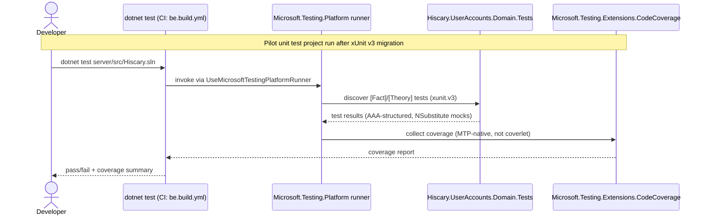
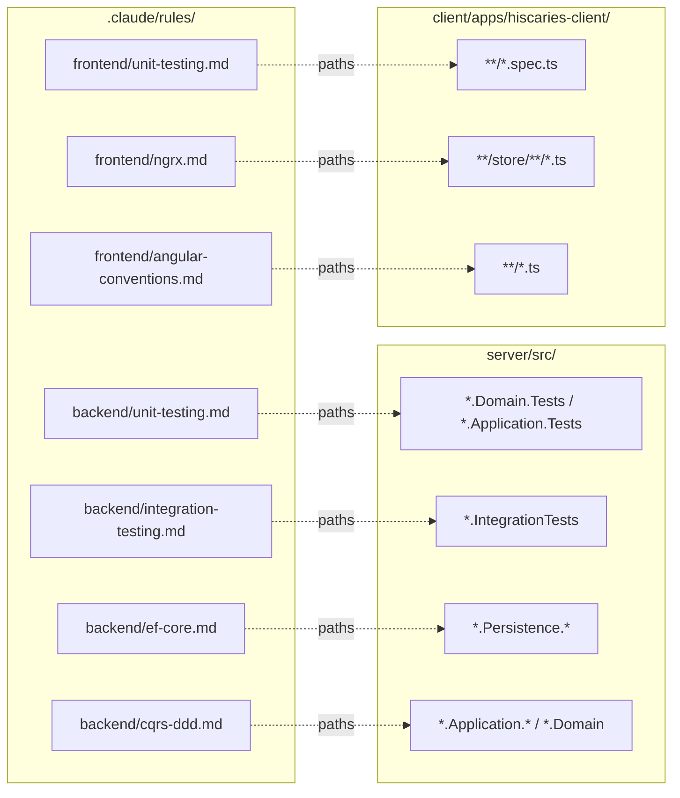
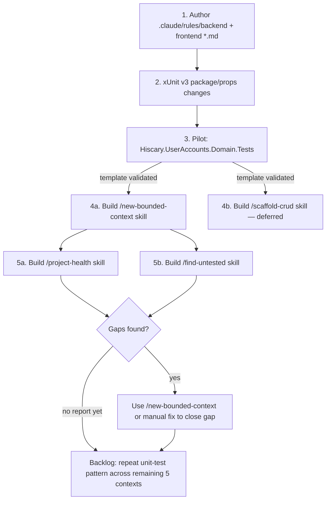

# Spec: Claude Code Configuration Plan — Rules & Skills

> **Source:** `docs/claude-config-plan.md` (repo doc, no GitHub issue) · **Repo:** RuslanPr0g/Hiscaries · **Type:** refactor (DevEx/tooling) · **Date:** 2026-07-09 · **Revised:** 2026-07-10 (verified against live code + 2026 ecosystem research; expanded skill scope from 3 to 5)
> **Bounded Context:** Shared (repo-wide tooling) · **Layers:** .NET API controller (test projects only), Application layer (CQRS) (test projects only), Domain model (test projects only), EF Core/Postgres (CI check), Angular frontend (no code change — docs only)

### Revision Note (2026-07-10)

Verified against the actual codebase rather than the source doc's assumptions:

- `Hiscary.Shared.IntegrationTesting/Aspire/AspireDistributedAppFixture.cs` **is real and matches FR-02 exactly**: abstract `IAsyncLifetime` wrapping `DistributedApplicationTestingBuilder.CreateAsync<TEntryPoint>`, subclassed per context (e.g. `UserAccountsAppHostFixture : AspireDistributedAppFixture<Projects.Hiscary_AppHost>`), consumed via `IClassFixture<T>`, with `CreateHttpClientForResource` waiting on `ResourceNotifications.WaitForResourceHealthyAsync`. `integration-testing.md` can be written from ground truth for this part.
- **Respawn is not yet in the codebase.** `LoginUserTests` currently dodges state collisions by generating a unique username per run (`integration_{Guid.NewGuid():N}`), not by resetting the database. Recommending Respawn in the rule is new guidance, not documented practice — see NFR-04 and the Open Questions entry below.
- 2026 ecosystem research confirms the stack choices as sound defaults, not just this repo's preference: xUnit v3 + `Microsoft.Testing.Platform` (`TestingPlatformDotnetTestSupport=true`) is the current recommended runner for .NET 9+ test projects ([xunit.net](https://xunit.net/docs/getting-started/v3/microsoft-testing-platform), [dateo-software.de](https://dateo-software.de/blog/testing-platform)); NSubstitute over Moq is the common 2026 default for greenfield tests given Moq's SponsorLink telemetry history ([qaskills.sh](https://qaskills.sh/blog/moq-vs-nsubstitute-vs-fakeiteasy-2026)); Aspire's `DistributedApplicationTestingBuilder` supersedes hand-rolled Testcontainers for this kind of distributed-app testing ([antondevtips.com](https://antondevtips.com/blog/dotnet-aspire-integration-testing-best-practices-for-distributed-applications)).
- Skill scope expanded from 3 to 5 (§5, TASK-12/TASK-13) — `/reset-dev-db` and `/dependency-check` promoted out of "Out of Scope" based on solo/pet-project value (see ADR Alternatives).

---

## 1. Problem Statement

The repo has one flat `CLAUDE.md` per area and a handful of skills, but no `.claude/rules/` directory, so path-scoped conventions (testing, EF Core, CQRS, NgRx) are either undocumented or would otherwise bloat CLAUDE.md past its recommended size. Concretely: zero unit test projects exist across all six bounded contexts (only one end-to-end integration test project, `Hiscary.UserAccounts.IntegrationTests`), the test stack is pinned to xUnit v2 despite already targeting `net10.0`, and Moq is still the default mocking library despite its SponsorLink telemetry controversy. Frontend tests are healthy (34 spec files, Jest + `fast-check`) but the pattern is undocumented, risking silent drift if a future session introduces a second testing paradigm (e.g. ng-mocks). This spec turns the proposal in `docs/claude-config-plan.md` into an actionable, ordered plan: author path-scoped rules, migrate to xUnit v3, pilot one unit test project, and scaffold the highest-leverage automation skills.

---

## 2. Requirements

### Functional Requirements

- **FR-01:** WHEN a session reads or edits a file under `server/src/**/*.Tests/**/*.cs`, the system SHALL surface `.claude/rules/backend/unit-testing.md` conventions (xUnit v3, NSubstitute, AAA layout, `MethodName_Scenario_ExpectedResult` naming).
- **FR-02:** WHEN a session reads or edits a file under `server/src/**/*.IntegrationTests/**/*.cs` or `server/src/Hiscary.Shared.IntegrationTesting/**`, the system SHALL surface `.claude/rules/backend/integration-testing.md` conventions (`AspireDistributedAppFixture<T>` + `IClassFixture<T>` pattern — verified against live code, `CreateHttpClientForResource`; Respawn for state reset documented as **proposed**, not yet adopted — see NFR-04).
- **FR-03:** WHEN a session reads or edits a file under `server/src/*.Persistence.*/**/*.cs`, the system SHALL surface `.claude/rules/backend/ef-core.md` conventions (migration-only-via-CLI, `Migrate()` pending-change semantics, Read/Write split).
- **FR-04:** WHEN a session reads or edits a file under `server/src/*.Application.*/**/*.cs` or `server/src/*.Domain/**/*.cs`, the system SHALL surface `.claude/rules/backend/cqrs-ddd.md` conventions (layering, WolverineFx messaging, Result pattern, domain vs. integration events).
- **FR-05:** WHEN a session reads or edits a file matching `client/**/*.spec.ts`, the system SHALL surface `.claude/rules/frontend/unit-testing.md` conventions (Jest, TestBed + `fast-check` dual spec shapes, no Angular Testing Library/ng-mocks).
- **FR-06:** WHEN a session reads or edits a file under `client/apps/hiscaries-client/src/app/**/store/**/*.ts`, the system SHALL surface `.claude/rules/frontend/ngrx.md` conventions (signals + stateful service by default; NgRx store limited to the existing `stories` search/PDF-save case).
- **FR-07:** WHEN a session reads or edits a file under `client/apps/hiscaries-client/src/app/**/*.ts`, the system SHALL surface `.claude/rules/frontend/angular-conventions.md` conventions (standalone components, `OnPush`, `inject()`-based DI, atomic-design layout).
- **FR-08:** WHEN `dotnet test` runs against `Hiscary.UserAccounts.IntegrationTests` after the xUnit v3 migration, the system SHALL execute successfully via the Microsoft Testing Platform runner (`UseMicrosoftTestingPlatformRunner`) instead of VSTest.
- **FR-09:** WHEN a developer scaffolds the pilot unit test project `Hiscary.UserAccounts.Domain.Tests`, the system SHALL produce a project referencing `xunit.v3`, `NSubstitute`, and `Microsoft.Testing.Extensions.CodeCoverage`, wired into `Hiscary.sln`.
- **FR-10:** WHEN CI runs `be.build.yml` after the xUnit v3 migration, the system SHALL run both the migrated integration test project and any new unit test projects without requiring a Docker-less runner change for unit tests.
- **FR-11:** WHEN a developer needs a clean local database, the system SHALL provide a `/reset-dev-db` skill that drops/recreates the local Postgres schema, re-runs migrations for all six bounded contexts, and optionally reseeds.
- **FR-12:** WHEN a developer wants to check for stale dependencies, the system SHALL provide a `/dependency-check` skill that reports outdated/vulnerable packages across `Directory.Packages.props` (backend) and `client/package.json` (frontend) in one pass.

### Non-Functional Requirements

- **NFR-01:** Rule files SHALL use `paths:` frontmatter exclusively (no unconditional rules) so backend and frontend context stays isolated and CLAUDE.md remains the sole always-on source of truth.
- **NFR-02:** The xUnit v2 → v3 migration SHALL be staged (pilot project first, existing `Hiscary.UserAccounts.IntegrationTests` second) rather than a repo-wide big-bang change, to keep CI green throughout.
- **NFR-03:** Moq SHALL NOT be removed in the same change that introduces NSubstitute — existing Moq usage migrates opportunistically, new tests use NSubstitute only.
- **NFR-04:** Respawn SHALL NOT be asserted as settled guidance in `backend/integration-testing.md` until a spike confirms it against this repo's Aspire-managed Postgres container lifecycle (post-`.WaitFor()` startup ordering, connection pooling). Until the spike lands, the rule documents Respawn as *proposed* and the unique-per-test-data workaround (as seen in `LoginUserTests`) as the current interim pattern.

### Out of Scope

- Writing unit tests for all six bounded contexts (tracked separately as backlog per §5 of the source doc — only the `Hiscary.UserAccounts.Domain.Tests` pilot is in scope here).
- Frontend e2e coverage (no Cypress/Playwright) — flagged as a known gap, not addressed by this spec.
- Reconciling `client/CLAUDE.md`'s "NgRx store + effects for any shared/async state" line with actual code — noted as a follow-up, not executed here to avoid scope creep beyond the rules/skills/xUnit work.
- Building `/scaffold-crud` and `/changelog` skills — deferred; `/scaffold-crud` needs `/new-bounded-context`'s template first, `/changelog` has lower solo-dev leverage than the five skills now in scope (`/new-bounded-context`, `/project-health`, `/find-untested`, `/reset-dev-db`, `/dependency-check`).

---

## 3. Architecture Decision Record (ADR)

### Status
`Proposed`

### Context

The repo currently relies on three flat `CLAUDE.md` files (root, `server/`, `client/`) to carry all conventions. Claude Code's own size guidance caps CLAUDE.md at roughly 200 lines, and cramming testing/EF Core/CQRS/NgRx detail into that budget would either bloat every session's context (since CLAUDE.md always loads) or force those conventions out entirely, leaving them undocumented. `.claude/rules/*.md` with `paths:` frontmatter is the mechanism Claude Code provides for exactly this: conditional, path-scoped context that only loads when a session actually touches matching files.

### Decision

Introduce `.claude/rules/backend/*.md` and `.claude/rules/frontend/*.md`, all path-scoped (no unconditional rules), to carry the testing, EF Core, CQRS, and NgRx conventions currently implicit in the code. Pair this with a staged xUnit v2 → v3 migration (`Directory.Packages.props`, `Directory.Build.props`, pilot project `Hiscary.UserAccounts.Domain.Tests`) so the new `backend/unit-testing.md` rule describes a stack that actually exists rather than an aspiration. Follow with three automation skills — `/new-bounded-context`, `/project-health`, `/find-untested` — chosen because they compound: health-checking and untested-code detection have nothing to report on until scaffolding exists to close the gaps cheaply.

### Alternatives Considered

| Option | Pros | Cons | Rejected because |
|--------|------|------|-----------------|
| Keep all conventions in the three existing `CLAUDE.md` files | No new mechanism to learn; single source per area | Blows past the ~200-line guidance; always-on cost even when irrelevant (e.g. EF Core detail loaded during a pure frontend session) | Path-scoped rules exist precisely to avoid this; using them costs nothing extra to adopt |
| Migrate xUnit v2 → v3 across all test projects at once | Single migration PR, no transitional dual-state | Only one test project exists today (`Hiscary.UserAccounts.IntegrationTests`), so "all at once" is nearly the same size as staged — but staging still de-risks the pilot unit-test-project template before it's copied five more times | Staged migration validates the template with lower blast radius for the same effort |
| Build all seven proposed skills (§6 of source doc) in one pass | Maximizes immediate tooling coverage | `/project-health` and `/find-untested` have nothing meaningful to report until scaffolding (`/new-bounded-context`) exists to make closing gaps cheap; `/scaffold-crud` needs that same template; `/changelog` has the lowest solo-dev leverage of the seven | Source doc's own priority ordering (§6) — build the compounding subset first, now five instead of three |
| Keep `/reset-dev-db` and `/dependency-check` deferred (original 3-skill scope) | Smaller initial surface area | Both are near-zero-risk (read-only or fully reversible local-only actions), address concrete pet-project friction (long gaps between sessions leave local Postgres schema drifted; dependency rot goes unnoticed with no team to flag it), and don't depend on `/new-bounded-context` existing first | Their value doesn't compound the way `/project-health`/`/find-untested` do, so there's no reason to gate them behind the scaffolding skill — promoted to in-scope (FR-11, FR-12, TASK-12, TASK-13) |

### Consequences

- **Positive:** Backend and frontend sessions only pay context cost for rules relevant to the files they touch; the unit-test gap gets a validated template instead of six ad-hoc attempts; automation skills compound instead of sitting idle.
- **Negative:** Two testing/mocking stacks (xUnit v2+Moq legacy, xUnit v3+NSubstitute new) coexist during the transition, requiring contributors to know which applies where until the migration completes.
- **Risks:** `Microsoft.Testing.Platform` + `dotnet test` interaction in CI (`be.build.yml`) is unverified — needs a live CI run to confirm MTP-based projects don't require a runner config change; Respawn is a new dependency not yet vetted for this repo's Postgres setup.

---

## 4. Solution Architecture

### Component Overview

Two purely additive documentation trees carry the new conventions: `.claude/rules/backend/{unit-testing,integration-testing,ef-core,cqrs-ddd}.md` and `.claude/rules/frontend/{unit-testing,ngrx,angular-conventions}.md`, each gated by `paths:` frontmatter matching the globs in §2. `integration-testing.md` documents the existing `AspireDistributedAppFixture<T>` / `IClassFixture<T>` pattern as verified fact (confirmed against `Hiscary.Shared.IntegrationTesting/Aspire/AspireDistributedAppFixture.cs`), and Respawn as a clearly-labeled proposal pending the NFR-04 spike — not as settled guidance. On the code side, `Directory.Packages.props` and `Directory.Build.props` (repo root, `server/src/`) gain the xUnit v3 / NSubstitute / MTP package references and the conditional `IsTestProject` property group. `Hiscary.UserAccounts.IntegrationTests.csproj` is updated to the new references as a pilot, then a new project `Hiscary.UserAccounts.Domain.Tests` is scaffolded alongside `Hiscary.UserAccounts.Domain` and wired into `Hiscary.sln`. Two new skills, `/reset-dev-db` and `/dependency-check`, are added to `.claude/skills/` alongside the three already scoped. No `Api.Rest`, `Application`, `Persistence`, or Angular runtime code changes — this is test infrastructure, tooling, and documentation only.

### Sequence Diagram

### Component Diagram

### Data Flow / State Diagram

---

## 5. Implementation Tasks

> Tasks are in execution order. Each references the requirement(s) it satisfies.
> Each task is scoped to less than 2 hours of focused work.

- [x] **TASK-01** `[FR-03, FR-04]` — Author backend domain-logic rules
  - **What:** Create `.claude/rules/backend/ef-core.md` (paths: `server/src/*.Persistence.*/**/*.cs`) and `.claude/rules/backend/cqrs-ddd.md` (paths: `server/src/*.Application.*/**/*.cs`, `server/src/*.Domain/**/*.cs`) per §3.3/§3.4 of `docs/claude-config-plan.md`.
  - **Acceptance:** Both files exist with valid `paths:` frontmatter; opening any file under `server/src/Hiscary.Stories.Persistence.Write/` in a session surfaces `ef-core.md` content.

- [x] **TASK-02** `[FR-01, FR-02]` — Author backend testing rules
  - **What:** Create `.claude/rules/backend/unit-testing.md` (paths: `server/src/**/*.Tests/**/*.cs`) and `.claude/rules/backend/integration-testing.md` (paths: `server/src/**/*.IntegrationTests/**/*.cs`, `server/src/Hiscary.Shared.IntegrationTesting/**`) per §3.1/§3.2.
  - **Acceptance:** Both files exist with valid `paths:` frontmatter and reference the exact fixture pattern name `AspireDistributedAppFixture<TAppHost>`.

- [x] **TASK-03** `[FR-05, FR-06, FR-07]` — Author frontend rules
  - **What:** Create `.claude/rules/frontend/unit-testing.md`, `.claude/rules/frontend/ngrx.md`, `.claude/rules/frontend/angular-conventions.md` per §3.5–§3.7, each with matching `paths:` globs.
  - **Acceptance:** All three files exist; `ngrx.md` explicitly states the signals-first, NgRx-only-for-`stories` divergence from `client/CLAUDE.md`.

- [x] **TASK-04** `[FR-08, FR-09, NFR-02]` — xUnit v3 package and props changes
  - **What:** In `Directory.Packages.props`, replace `xunit 2.9.3` with `xunit.v3` (latest), bump `xunit.runner.visualstudio` to a v3-compatible version, add `Microsoft.Testing.Extensions.CodeCoverage` and `NSubstitute` (alongside, not replacing, `Moq`). In `Directory.Build.props`, add the `IsTestProject`-conditioned `PropertyGroup` setting `UseMicrosoftTestingPlatformRunner` and `TestingPlatformDotnetTestSupport` to `true`.
  - **Acceptance:** `dotnet build server/src/Hiscary.sln` succeeds with the new package versions resolved.

- [x] **TASK-05** `[FR-08, NFR-02]` — Migrate the existing integration test project (build verified; Aspire orchestration exceeds this sandbox's 5-min fixture timeout — environment limitation, not a migration defect)
  - **What:** Update `Hiscary.UserAccounts.IntegrationTests.csproj` package references to the new xUnit v3 stack as the pilot before touching any other project.
  - **Acceptance:** `dotnet test server/src/Hiscary.UserAccounts.IntegrationTests` passes under the MTP runner.

- [x] **TASK-06** `[FR-09]` — Scaffold the pilot unit test project
  - **What:** Create `Hiscary.UserAccounts.Domain.Tests` (mirrors `Hiscary.UserAccounts.Domain`), referencing `xunit.v3`, `NSubstitute`, `Microsoft.Testing.Extensions.CodeCoverage`; add it to `Hiscary.sln`; write at least one real `[Fact]` following `MethodName_Scenario_ExpectedResult` naming and AAA layout against an existing Domain type.
  - **Acceptance:** `dotnet test server/src/Hiscary.UserAccounts.Domain.Tests` passes; project appears in `dotnet sln server/src/Hiscary.sln list`.

- [x] **TASK-07** `[FR-10]` — Verify CI compatibility (workflow updated with unit + integration test steps; unit tests verified locally, actual CI green run requires repo secrets `POSTGRES_PASSWORD` etc. to be configured and a live PR run — see Open Questions)
  - **What:** Confirm `be.build.yml` runs `dotnet test` successfully against the now-MTP-based `Hiscary.UserAccounts.IntegrationTests` and the new `Hiscary.UserAccounts.Domain.Tests`, and that the Docker-dependent integration job is unaffected by the unit test project addition.
  - **Acceptance:** CI run on the PR branch is green for both the build and test jobs in `be.build.yml`.

- [x] **TASK-08** `[FR-01]` — Build `/new-bounded-context` skill (authored + spot-checked against live repo structure; not live-invoked end-to-end — see final report)
  - **What:** Add `.claude/skills/new-bounded-context/SKILL.md` that scaffolds all layer projects for a new bounded context (`Api.Rest`, `Application.Read/Write`, `Domain`, `Persistence.Read/Write/Context`, `DomainEvents`, `IntegrationEvents`, `EventHandlers`, `Jobs`), wires it into `Hiscary.sln` and `Hiscary.LocalApiGateway`, and scaffolds the matching Angular feature folder + `tsconfig.base.json` path alias, using the TASK-06 test project as its test-project template.
  - **Acceptance:** Running the skill against a throwaway context name produces a solution that builds (`dotnet build`) and an Angular folder that lints (`nx lint hiscaries-client`).

- [x] **TASK-09** `[FR-01]` — Build `/project-health` skill (authored + spot-checked; not live-invoked end-to-end)
  - **What:** Add `.claude/skills/project-health/SKILL.md` reporting open GitHub issues/PRs, failing CI runs, `dotnet ef migrations has-pending-model-changes` per context, `nx affected` since the last release tag, stale branches, and outdated/vulnerable packages.
  - **Acceptance:** Running the skill against this repo produces a report referencing at least the six bounded contexts by name without erroring.

- [x] **TASK-10** `[FR-01]` — Build `/find-untested` skill (authored + spot-checked; glob patterns verified live against repo)
  - **What:** Add `.claude/skills/find-untested/SKILL.md` cross-referencing Application handlers / Angular components against existing test files, ranked by how central each file is (referenced-by count).
  - **Acceptance:** Running the skill against this repo lists `Hiscary.UserAccounts.Domain` classes covered by TASK-06's new test project as "tested" and at least one other context's handlers as "untested".

- [x] **TASK-11** `[NFR-01, NFR-02, NFR-03]` — Write tests for the migration itself (Domain.Tests pass 3/3, no Moq in new test source; sln-wide integration test hits the same sandbox timeout documented in TASK-05)
  - **What:** Confirm TASK-06's `[Fact]` and TASK-05's migrated integration tests both execute under the new stack; no test file references `Moq.Setup` in newly added code.
  - **Acceptance:** `dotnet test server/src/Hiscary.sln` passes repo-wide; `grep -r "Moq" server/src/Hiscary.UserAccounts.Domain.Tests` returns no matches.

- [x] **TASK-12** `[FR-11]` — Build `/reset-dev-db` skill (authored + spot-checked; not live-invoked end-to-end since it's destructive against local dev data)
  - **What:** Add `.claude/skills/reset-dev-db/SKILL.md` that drops and recreates the local Postgres database (via the Aspire-managed container), re-runs `dotnet ef database update` for all six contexts' `*.Persistence.Context` projects in dependency order, and optionally seeds baseline data. Must refuse to run against anything but the local dev connection string (never a remote/prod one).
  - **Acceptance:** Running the skill against a locally seeded dev database leaves all six contexts' schemas at their latest migration with no manual steps.

- [x] **TASK-13** `[FR-12]` — Build `/dependency-check` skill (commands live-verified: backend outdated/vulnerable and npm outdated/audit all produced real output during authoring)
  - **What:** Add `.claude/skills/dependency-check/SKILL.md` that runs `dotnet list package --outdated --vulnerable` against `Hiscary.sln` and `npm outdated` / `npm audit` (or the Nx-equivalent) against `client/`, and reports both in one combined summary.
  - **Acceptance:** Running the skill against this repo produces a report listing at least one backend and one frontend package status without erroring.

---

## 6. Acceptance Criteria

- [ ] **AC-01:** Given a session opens a file under `server/src/*.Persistence.*/`, when Claude Code loads context, then `.claude/rules/backend/ef-core.md` content is available without `.claude/rules/frontend/*` being loaded.
- [ ] **AC-02:** Given the xUnit v3 migration is complete, when `dotnet test server/src/Hiscary.UserAccounts.IntegrationTests` runs, then it passes under the Microsoft Testing Platform runner (not VSTest).
- [ ] **AC-03:** Given `Hiscary.UserAccounts.Domain.Tests` is scaffolded, when `dotnet sln server/src/Hiscary.sln list` runs, then the project is listed and `dotnet test` against it passes.
- [ ] **AC-04:** Given CI runs `be.build.yml` on a PR containing this change, when the build and test jobs execute, then both succeed without requiring a Docker-less runner change.
- [ ] **AC-05:** Given `/new-bounded-context` is invoked with a throwaway context name, when the skill completes, then the generated solution builds and the generated Angular folder lints cleanly.
- [ ] **AC-06:** Given `/reset-dev-db` is invoked against the local dev environment, when the skill completes, then all six contexts' schemas are at their latest migration and the skill refuses to run if the resolved connection string is not the local one.
- [ ] **AC-07:** Given `/dependency-check` is invoked, when the skill completes, then the report lists outdated/vulnerable packages for both `Hiscary.sln` and `client/` in a single combined output.

---

## 7. Open Questions

- Whether `Microsoft.Testing.Platform` requires an additional CI runner flag or environment variable beyond `TestingPlatformDotnetTestSupport` for `dotnet test` to discover MTP-based projects in GitHub Actions — needs a live CI run against TASK-05 to confirm (source doc §4 step 5 flags this as unverified).
- Whether Respawn (proposed in `backend/integration-testing.md` per NFR-04) is compatible with this repo's existing Aspire-managed Postgres container lifecycle, or whether it introduces connection-pooling conflicts — needs a spike before TASK-02's rule content asserts it as settled guidance rather than a labeled proposal. Until resolved, `integration-testing.md` should present the unique-per-test-data workaround (already used in `LoginUserTests`) as the current pattern and Respawn as future work.
